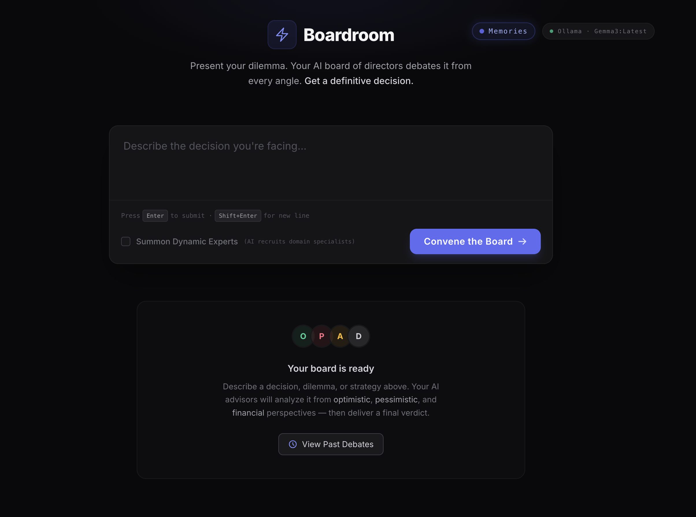

# The Boardroom

> Your Personal AI Proxy Board of Directors

The Boardroom is an AI-powered decision intelligence platform that simulates a full corporate board to help you make better decisions. Instead of getting a single AI opinion, your dilemma is debated by a panel of specialized AI executives — each with a distinct perspective — before a final, definitive verdict is delivered.

**Present a dilemma → AI board debates it → Get a decision with clear rationale.**



---

## Features

- **Multi-Agent Debate** — Multiple specialized AI agents analyze your problem from different angles simultaneously.
- **Streaming Responses** — Watch each board member's analysis stream in real-time via Server-Sent Events.
- **Dynamic Experts** — Optionally summon AI-recruited domain specialists tailored to your specific topic.
- **Provider Flexibility** — Swap between local models (Ollama), cloud APIs (Gemini).

---

## How It Works

The execution flows through progressive **Waves**, where each wave builds on the output of the previous one:

```
┌─────────────────────────────────────────────────────────────────┐
│  Wave 0 · Clarification                                         │
│  The Gatekeeper asks follow-up questions if your prompt is      │
│  too vague. You can skip this step.                             │
├─────────────────────────────────────────────────────────────────┤
│  Wave 1 · Context Analysis                       (parallel)     │
│  ┌──────────────────────┐  ┌──────────────────────────────┐     │
│  │ Chief of Staff       │  │ Chief Economist              │     │
│  │ User profile & goals │  │ Macro trends & market forces │     │
│  └──────────────────────┘  └──────────────────────────────┘     │
├─────────────────────────────────────────────────────────────────┤
│  Wave 2 · Board Debate                           (parallel)     │
│  ┌────────────┐  ┌────────────┐  ┌─────────────────────┐        │
│  │ Optimist   │  │ Pessimist  │  │ Analyst             │        │
│  │ Max upside │  │ All risks  │  │ Quantitative review │        │
│  └────────────┘  └────────────┘  └─────────────────────┘        │
├─────────────────────────────────────────────────────────────────┤
│  Wave 2.5 · Expert Panel (optional)              (parallel)     │
│  AI-recruited domain specialists based on your topic.           │
├─────────────────────────────────────────────────────────────────┤
│  Wave 3 · The Verdict                                           │
│  The Decider synthesizes all arguments into a single            │
│  Yes / No / Pivot decision with concrete next steps.            │
└─────────────────────────────────────────────────────────────────┘
```

---

## Quick Start

> 📖 For detailed instructions on providers (Ollama, Gemini), Docker volumes, and all configuration options, see the **[Deployment Guide](docs/deployment.md)**.

### Docker (fastest)
```bash
docker run -p 8080:8080 \
  -v /tmp/boardroom/data:/root/data \
  -e LLM_PROVIDER=gemini \
  -e GEMINI_API_KEY=[GCP_API_KEY] \
  -e LLM_MODEL=gemini-2.5-flash \
  -e MAX_CONCURRENT_AGENTS=3 \
  sadlil/boardroom:latest
```

### From Source
```bash
# Build
go build -o boardroom ./cmd/boardroom

# Configure and run
cp .env.example .env   # edit with your provider/keys
./boardroom -env=.env
```

Open **[http://localhost:8080](http://localhost:8080)** and present your dilemma.

---

## Tech Stack

| Layer | Technology |
|---|---|
| Backend | Go · `net/http` |
| Frontend | HTML5 · HTMX · Tailwind CSS (CDN) |
| AI Providers | Ollama (local) · Google Gemini (cloud) |
| Streaming | Native Server-Sent Events (SSE) |
| Storage | SQLite (sessions) · Vector index (memory) |
| Deployment | Docker · `sadlil/boardroom:latest` |

---

## License
MIT
